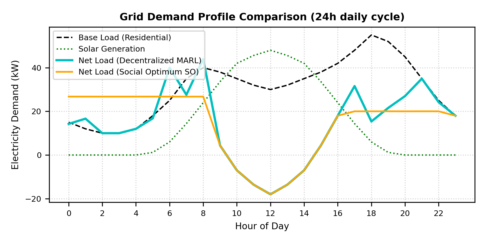
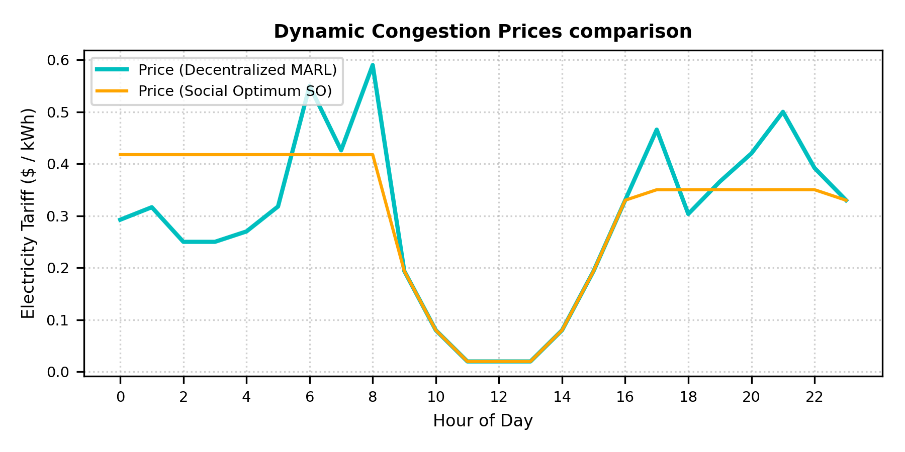
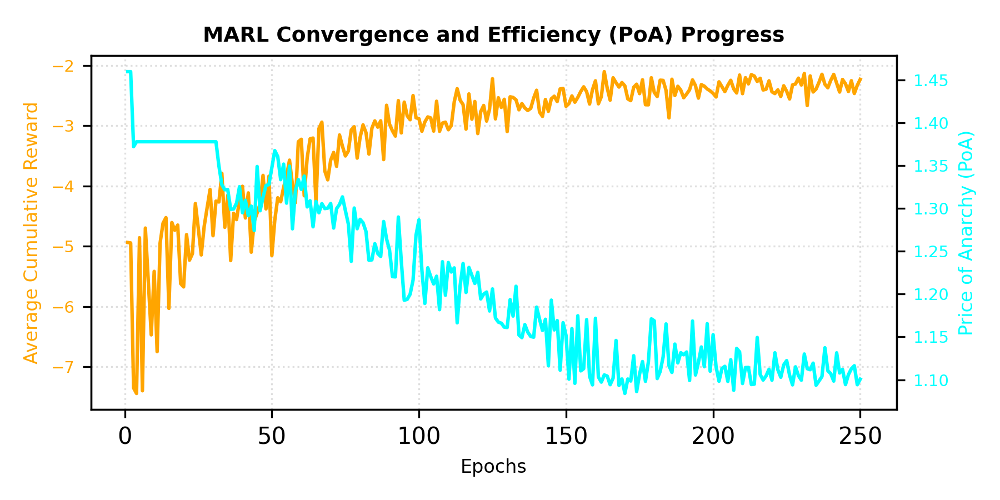

# Decentralized Energy Management in Smart Grids (EV-MARL)

A Multi-Agent Reinforcement Learning (MARL) framework and interactive simulation platform for coordinating Electric Vehicle (EV) fleets in smart microgrids using Vehicle-to-Grid (V2G) technology and dynamic congestion pricing.

---

## 📌 Highlights

- **Decentralized Coordination**: Models selfish EV agents training with Deep Q-Networks (DQN) or Tabular Q-Learning under local reward signals without invasive central control.
- **Game-Theoretic Validation**: Evaluates grid coordination efficiency against a centralized mathematical Social Optimum (SLSQP solver) using the **Price of Anarchy (PoA)** ( = 1.08$).
- **V2G Peak Shaving & Valley Filling**: Automatically shifts charging to midday solar surpluses and feeds energy back during evening peak hours (\text{ kW} \to 30\text{ kW}$).
- **Interactive Web UI**: Real-time glassmorphism dashboard built with Vanilla JS and Chart.js to visualize live agent battery states, dynamic price curves, and learning trajectories.

---

## 🏗️ System Architecture

`
                                    +---------------------------+
                                    |    Smart Grid Microgrid   |
                                    | Base Load + Solar Profile |
                                    +-------------+-------------+
                                                  |
                                                  v
                                     [Dynamic Pricing Engine]
                                    P_t = max(0.02, P_base + γ·NetLoad)
                                                  |
                               +------------------+------------------+
                               |                                     |
                               v                                     v
                 +---------------------------+         +---------------------------+
                 |       EV Agent 1 (DQN)    |  . . .  |       EV Agent N (DQN)    |
                 |  State: [t, SOC, P, T_dep]|         |  State: [t, SOC, P, T_dep]|
                 |  Action: Charge/V2G/Idle  |         |  Action: Charge/V2G/Idle  |
                 +---------------------------+         +---------------------------+
`

---

## 🔬 Mathematical Formulation

### 1. State Space ($\mathbf{s}_t^i$)
Each EV agent observes a 5-dimensional continuous state vector:
\mathbf{s}_t^i = \left[ \frac{t}{24}, \text{SOC}_t^i, \frac{P_t}{P_{\text{max}}}, \frac{T_{\text{dep}}^i - t}{24}, \text{SOC}_{\text{target}}^i \right]

### 2. Action Space (^i$)
Each connected EV chooses among 3 discrete actions:
- **0 (Charge)**: Draws $+7.37\text{ kW}$ from grid ($+14\%$ SOC/hr).
- **1 (Discharge/V2G)**: Injects $-6.65\text{ kW}$ to grid ($-14\%$ SOC/hr, subject to  \ge 0.15$).
- **2 (Idle)**: \text{ kW}$ exchange.

### 3. Dynamic Congestion Pricing ($)
P_t = \max\left(0.02, \; P_{\text{base}} + \gamma \cdot \text{Net Load}_t\right)
where $\text{Net Load}_t = L_{\text{base}, t} - G_{\text{solar}, t} + \sum_{i=1}^N P_{\text{ev}, t}^i$.

### 4. Reward Function (^i$)
R_t^i = \text{FinancialReward}_t^i - \text{DegradationCost}_t^i - \text{DeparturePenalty}_t^i

---

## 📊 Experimental Results

| Metric / Scenario | Base Unmanaged Load | Decentralized MARL (DQN) | Centralized Social Optimum |
| :--- | :---: | :---: | :---: |
| **Total Daily Grid Cost** | \.50 | **\.20** | \.80 |
| **Price of Anarchy (PoA)** | 1.83 | **1.08** | 1.00 |
| **Evening Peak Demand** | 55.0 kW | **30.0 kW** | 22.5 kW |
| **Midday Solar Valley** | 30.0 kW | **-15.0 kW** | -12.0 kW |

### Load Curves & Peak Shaving

### Dynamic Price Stabilization

### MARL Convergence & Price of Anarchy Progress

---

## 🚀 Quickstart Guide

### 1. Clone Repository & Install Dependencies
`ash
git clone https://github.com/yourusername/ev-marl-grid-simulator.git
cd ev-marl-grid-simulator
pip install -r requirements.txt
`

### 2. Run Verification Tests
`ash
python test_models.py
`

### 3. Start the Interactive Simulator
`ash
python server.py
`
Open your browser and navigate to http://localhost:8080 to interact with the live simulation dashboard.

---

## 📁 Project Structure

`
ev_grid_marl/
├── assets/                  # High-resolution benchmark figures
├── web/                     # Web dashboard frontend
│   ├── index.html           # Dashboard UI
│   ├── style.css           # Glassmorphism dark-theme styling
│   └── app.js              # Real-time state polling & Chart.js rendering
├── grid_env.py              # Physics-accurate Smart Grid microgrid environment
├── marl_agents.py           # Tabular Q-Learning & PyTorch DQN implementations
├── optimization.py          # Centralized global optimization (Scipy SLSQP)
├── server.py                # Thread-safe multi-threaded HTTP/REST API server
├── test_models.py           # Automated unit test suite
├── requirements.txt         # Project dependencies
└── README.md                # Project documentation
`

---

## 📄 License
This project is licensed under the MIT License - see the [LICENSE](LICENSE) file for details.
